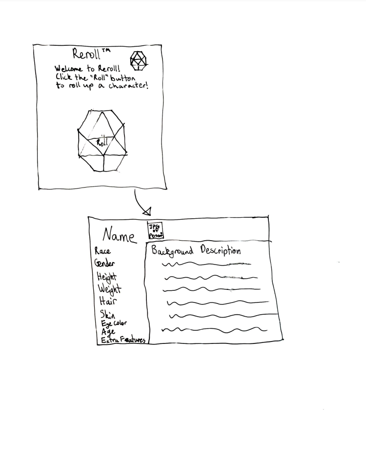

# Cyberchase Design Document

## *Reroll* Design

## 1. Problem Statement

Reroll is a character generating software designed to provide quick and easy characters for tabletop gaming.

One of the biggest issues related to tabletop gaming is that anything can happen to anyone at any time, as nothing is scripted. What Reroll aims to provide is an assistance tool to provide the game runner seamless access to characters for use in the game that come equipped with deep, profound, and interesting characteristics to make more interactive and fulfilling non-player characters for your world.

Or maybe you are a player who needs inspiration? Reroll can be used by more than just a game runner, as all players can use Reroll to provide that spark of innovation that might lead to the basis of your next character.


## 2. Top Questions to Resolve in Review

*List the most important questions you have about your design, or things that
you are still debating internally that you might like help working through.*

1. Front End Development - what is it, what does it entail?
2. What will our Front End actually look like?
3. Can we use external resources like other APIs to provide some of our information, or should we reinvent the wheel?

## 3. Use Cases

*This is where we work backwards from the customer and define what our customers
would like to do (and why). You may also include use cases for yourselves, or
for the organization providing the product to customers.*

U1. *As a Dungeon Master, I want to quickly pull up a character for use in my game, as well as be able to seek inspiration for any Non-Player Characters I want to create*

U2. *As a Player, I want to be able to quickly flip through character ideas to provide me with inspiration on a variety of topics related to creating my Player Character*

U3. *As anyone who needs fantasy inspired names, locations, and character backstories; this program provides rapid easy access to a plethora of ideas.*

## 4. Project Scope

*This program is largely designed to provide thematic information. To allow for the largest audience, we will not be including
 statistical information about characters, but instead focus on information that can make characters feel more alive and help define them.*

### 4.1. In Scope

*Character design - including age, gender, race, height, physical features as well as clothing*

*Character backstory - including lineage, parent professions, personality traits, achievements, relationships*

### 4.2. Out of Scope

*A sprite visual of our characters*

*statistical information related to specific game types or versions*

*modular and more specific character customization - ex: instead of a whole outfit table there would be seperate tables for gloves, hat, etc.*

*user capability to seek more specific features, just names, just appearance, just backstory*

*user saving as a pdf or other document type*

# 5. Proposed Architecture Overview

*A simple front end display prompting the user to press a button to roll for the the character, whereupon a lambda 
get function is called through the API to pull from the relevant DynamoDB tables the relevant character details*

*Refer to FrontToEndArchitecture.puml for overall structure of project, and refer to RepoStructure.puml for design of the project repository*

*As our project at its current iteration does not take in user input, we need a single get request to generate a character. Most of the process will occur within
the project repository, where a character with all of its features will be generated using a mix of enums and dynamoDB tables. After construction, the character
will be transported to the front end, where it will be displayed to the user.*

# 6. API

## 6.1. Public Models

```
//CharacterModel

BackgroundAttributes backgroundAttributes
PhysicalAttributes PhysicalAttributes
```

## 6.2. *First Endpoint*

*Accepts `GET` request to `/characters/`
*Returns CharacterModel.

## 7. Tables

### 7.1. `names`

```
race // partition key, string
name // sort key, string
```

### 7.2. `FamilyHistory`

```
parentProfessions // partition key, string
childhood // sort key, string
```

### 7.3. `Talents`

```
achievements // partition key, string
profession // sort key, string
```

### 7.4. `Flaws`

```
alignment // partition key, string
```

# 8. Pages



